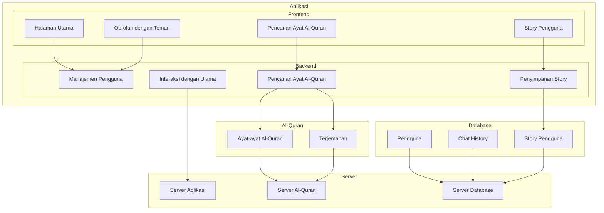
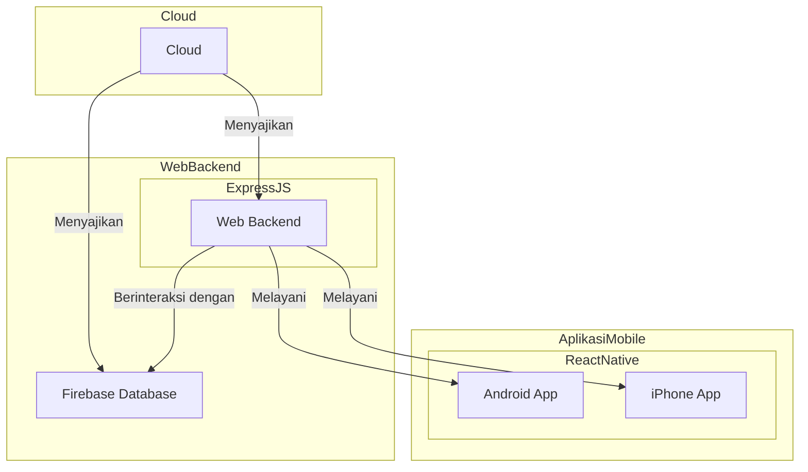

## 1.1 Latar Belakang

Latar belakang pembuatan aplikasi chat dengan fitur Al-Quran dapat melibatkan beberapa pertimbangan dan motivasi. Berikut ini adalah latar belakang umum yang mungkin mendorong pembuatan aplikasi ini:

1.Peningkatan Literasi Keagamaan: Terdapat minat yang kuat dalam meningkatkan pemahaman dan literasi tentang Al-Quran di kalangan pengguna. Aplikasi ini dibuat untuk memberikan akses yang mudah dan cepat ke ayat-ayat Al-Quran, terjemahan, serta tafsir, sehingga pengguna dapat memahami dan merujuk ayat-ayat Al-Quran dengan lebih baik.

2.Pertumbuhan Penggunaan Aplikasi Chat: Aplikasi chatting telah menjadi bagian integral dari kehidupan sehari-hari. Oleh karena itu, menggabungkan fitur Al-Quran dalam aplikasi chatting akan membuatnya lebih mudah diakses dan digunakan oleh berbagai kelompok umur.

3.Komunitas Keagamaan dan Pembelajaran: Aplikasi ini juga mungkin dibuat untuk mendukung komunitas keagamaan yang ingin berbagi pengetahuan, berdiskusi, dan berdoa bersama. Pengguna dapat dengan mudah berkomunikasi tentang isu-isu keagamaan, menjawab pertanyaan, atau meminta panduan dari ulama atau pakar keagamaan.

4.Interaksi Sosial: Kemampuan untuk berbagi cerita atau story dalam aplikasi chat dapat memungkinkan pengguna berinteraksi secara lebih pribadi, berbagi pengalaman keagamaan, dan memperdalam ikatan sosial mereka dengan teman-teman seiman.

5.Potensi Kepuasan Pelanggan: Dengan menyediakan semua fitur ini dalam satu aplikasi, pengembang dapat memenuhi kebutuhan dan harapan pelanggan dalam satu wadah, yang pada gilirannya dapat meningkatkan kepuasan pengguna dan membantu menjadikan aplikasi ini populer.

6.Tujuan Edukasi dan Dakwah: Aplikasi ini juga dapat berfungsi sebagai alat pendidikan dan dakwah dalam rangka menyebarkan pesan-pesan keagamaan, memberikan informasi, dan menjadikan pemahaman Al-Quran lebih luas di kalangan masyarakat.

## 1.2. Deksripsi Teknologi Informasi

Aplikasi ini menyediakan berbagai fitur, termasuk kemampuan untuk mencari ayat-ayat Al-Quran dengan cepat dan mudah. Ini memungkinkan pengguna untuk merujuk ayat-ayat dalam konteks diskusi tentang isu-isu keagamaan atau untuk tujuan pembelajaran. Selain itu, pengguna dapat dengan mudah membagikan ayat-ayat Al-Quran dalam obrolan mereka, memfasilitasi berbagi pengetahuan tentang agama dengan teman-teman mereka.

Aplikasi ini juga memungkinkan pengguna untuk menandai ayat-ayat Al-Quran sebagai favorit, sehingga mereka dapat dengan cepat mengakses dan merujuk kembali ayat-ayat yang mereka anggap penting. Ini adalah fitur yang sangat berguna untuk studi dan praktik keagamaan sehari-hari.

Selain fitur-fitur tersebut, pengguna juga dapat berkomunikasi secara langsung dengan ulama atau pakar keagamaan melalui obrolan atau panggilan video. Hal ini membuka peluang bagi pengguna untuk mendapatkan pandangan dan pemahaman yang lebih mendalam tentang isu-isu keagamaan yang mereka hadapi.

Terakhir, aplikasi ini memungkinkan pengguna untuk berbagi cerita atau story keagamaan mereka, menciptakan interaksi sosial yang lebih pribadi, dan memungkinkan pengguna berbagi pengalaman dan refleksi keagamaan dengan teman-teman atau anggota komunitas dalam aplikasi chat ini.

Dengan cara ini, aplikasi ini menggabungkan teknologi informasi dengan aspek-aspek keagamaan untuk menciptakan pengalaman yang kaya dan mendalam bagi pengguna, mendukung pembelajaran, interaksi sosial, dan praktik keagamaan.

## 1.3. Branding

Merk: ISAC ZYN

Tagline: "Menggabungkan Chat dan Kehidupan Keagamaan"

Campaign: "Chat dan Temukan Hikmah dalam Setiap Pesan"

Target user:

Kelompok Umur 18-45 tahun,
Individu dengan minat dalam agama Islam,
Komunitas keagamaan dan diskusi agama,
Orang-orang yang ingin mendalami Al-Quran,
User experience theme:

Mudah: Penggunaan yang intuitif untuk semua tingkat pengguna, tanpa hambatan teknis.
Sederhana: Desain minimalis dan fokus pada fitur-fitur utama.
Menyenangkan: Memberikan pengalaman positif dalam berinteraksi dengan fitur-fitur agama.

Warna:Coklat dan abu-abu akan memberikan nuansa yang lebih tenang dan kalem, cocok dengan tema keagamaan.
Coklat dapat mencerminkan kedalaman dan kebijaksanaan, sementara abu-abu memberikan kesan ketenangan dan keseimbangan.

Inspirasi desain:

## 2. User Story

| Sebagai                             | Saya ingin bisa                            | Sehingga                               | Prioritas |
|------------------------------------|------------------------------------------|---------------------------------------|----------|
| Pengguna                            | Mencari ayat-ayat Al-Quran dengan mudah  | Menemukan referensi ayat-ayat dengan cepat saat berdiskusi tentang isu-isu keagamaan | ⭐⭐⭐⭐⭐  |
| Pengguna                            | Membagikan ayat-ayat Al-Quran dalam obrolan dengan teman-teman saya | Berbagi pesan dan pengetahuan tentang Al-Quran dengan mudah dalam aplikasi chat | ⭐⭐⭐ |
| Pengguna                            | Menandai ayat-ayat Al-Quran sebagai favorit | Mengakses dan merujuk kembali ayat-ayat penting dengan mudah | ⭐⭐ |
| Pengguna                            | Ngechat dengan teman-teman dalam aplikasi | Berkomunikasi, berbagi ide, dan berdiskusi dengan teman-teman tentang isu-isu keagamaan atau hal-hal lainnya sambil tetap memiliki akses mudah ke fitur Al-Quran | ⭐⭐⭐⭐⭐ |
| Pengguna                            | Menambahkan cerita atau story ke dalam aplikasi | Berbagi pengalaman pribadi, cerita keagamaan, atau refleksi sehari-hari dengan teman-teman atau anggota komunitas dalam aplikasi chat ini | ⭐⭐⭐⭐ |

## 3. Struktur Data

## 4. Arsitektur Sistem

## 5. Teknologi, Library, dan Framework

- **Figma**: Saya menggunakan Figma untuk merancang tampilan dan antarmuka pengguna kami. Ini memudahkan saya untuk berkolaborasi dalam proses desain.

- **Visual Studio Code (VS Code)**: saya menulis kode aplikasi menggunakan VS Code. Alat ini sangat membantu dalam menulis dan mengelola kode.

- **React Native**: Aplikasi ini dibangun menggunakan kerangka kerja React Native. Ini memungkinkan kami untuk membuat aplikasi yang dapat dijalankan pada Android dan iPhone dengan menggunakan JavaScript.

- **Axios**: Saya menggunakan Axios untuk mengirim permintaan ke server saya. Ini membantu saya berkomunikasi dengan server dan mendapatkan atau mengirim data.

- **Android Studio**: Saya mengembangkan aplikasi Android saya dengan bantuan Android Studio. Ini memungkinkan saya untuk menguji dan mengembangkan aplikasi di platform Android.

- **Firebase**: saya memanfaatkan Firebase sebagai basis data kami dan untuk layanan backend. Firebase membantu saya dalam mengelola data pengguna, otorisasi, dan notifikasi.

## 6. Desain User Experience dan User Interface

## 7. Demonstrasi Video

Link youtube nya

## 8. Bagaimana mesin komputasi dan sistem operasi berperan dalam produk teknologi informasimu ?

Link youtube nya di detik jawaban ini

## 9. Bagaimana algoritma, struktur data, dan bahasa pemrograman berperan dalam produk teknologi informasimu ?

Link youtube nya di detik jawaban ini

## 10. Bagaimana metode pengembangan perangkat lunak / Software Development Life Cycle berperan dalam produk teknologi informasimu ?

Link youtube nya di detik jawaban ini

## 11. Bagaimana database / sistem basis data berperan dalam produk teknologi informasimu ?

Link youtube nya di detik jawaban ini
